# Final Project

- [ ] Read the [project requirements](https://vikramsinghmtl.github.io/420-5P6-Game-Programming/project/requirements).
- [ ] Replace the sample proposal below with the one for your game idea.
- [ ] Get the proposal greenlit by Vik.
- [ ] Place any assets in `assets/` and remember to update `src/config.json`.
- [ ] Decide on a height and width inside `src/globals.js`. The height and width will most likely be determined based on the size of the assets you find.
- [ ] Start building the individual components of your game, constantly referring to the proposal you wrote to keep yourself on track.
- [ ] Good luck, you got this!

---

# Proposal - Blades of the Dune

## ✒️ Description

Blades of the Dune is a top-down action roguelike set in the heart of a vast and ancient desert. Players control a wandering ninja who enters the sun-scorched ruins of a forgotten temple in search of a mythical artifact buried beneath the dunes. Legends say the relic holds the power to control the desert winds, but it is fiercely guarded by cursed warriors, ancient traps, and a ruthless warlord who rules the buried temple.

Each run challenges the player to push deeper into a procedurally generated dungeon made up of dusty chambers, hidden passages, and crumbling ruins. No two attempts will ever be the same. Enemy layouts, loot, traps, room shapes, and the order of areas are reshuffled every time.

As a fast and agile ninja, players must slash through enemies, dodge traps, collect power-ups, and adapt to the unpredictability of each floor. The deeper the player travels, the harsher the environment becomes: stronger foes emerge, enemy attack patterns evolve, and hazard density increases.

The game blends roguelike replayability, fast-paced ninja combat, and desert-themed dungeon exploration to deliver a short, replayable, and satisfying challenge. The ultimate goal is to defeat the Warlord of the Dunes and escape the collapsing temple, but one mistake and its all over.

## 🕹️ Gameplay

In Blades of the Dune, the player navigates room by room through an ever-changing dungeon buried beneath the sands. Each chamber the ninja enters is sealed behind them, turning every encounter into a contained challenge that must be resolved before they can advance. Enemies awakenfrom beneath the dust, or wander the halls until the player intrudes on their territory. Once all threats in a room are eliminated, the final door slides open, granting passage to the next chamber.

Movement is fluid, allowing the ninja to dart across the room, weave around hazards, and close the distance on enemies. Combat is intentionally simple but sharp: a light, fast sword strike forms the core of the player’s offensive ability, rewarding positioning and timing rather than button-mashing. Different enemies demand different reactions, stronger variants appear deeper in the dungeon forcing players to constantly reassess their surroundings.

As the player progresses, the atmosphere becomes increasingly tense. Rooms grow more compact, traps appear more frequently, and enemy groups become larger and more aggressive. Along the way, the player may come across small opportunities to recover or strengthen themselves: a stray potion left behind by a fallen explorer, an ancient relic humming with power. These moments break up the intensity of combat and add just enough unpredictability to make each run feel distinct.

Reaching the later chambers culminates in encounters with powerful opponents, including a boss that acts as the final battle. This marks the ultimate test, one that requires careful use of movement, timing, and any temporary power-ups acquired along the way.

Failure is permanent, as the game embraces traditional roguelike permadeath. A single mistake sends the player back to the entrance, but the knowledge gained from previous attempts—enemy patterns, traps, strategies remains with them. Scores are tracked across runs, encouraging players to refine their mastery of the dungeon. The appeal lies not just in reaching the end, but in gradually pushing farther with each attempt, learning the rhythm of the desert and the dangers that lurk beneath it.

## 📃 Requirements

The player will be able to:

1. View the title screen upon launching the game.
2. Select "Start Game" from the title screen to begin a new run.
3. Select "Instructions" from the title screen to view game controls and objectives.
4. View the instructions screen showing WASD/Arrow controls for movement, Spacebar for attack, and ESC for pause.
5. View the game objective on the instructions screen (fight through rooms, defeat enemies, reach and defeat boss in Room 10).
6. Return to the title screen from the instructions screen by selecting "Back to Menu".
7. Select "High Scores" from the title screen to view the best score achieved.
8. View the highest score persisted from previous game sessions on the high scores screen.
9. Return to the title screen from the high scores screen by selecting "Back to Menu".
10. Enter the first procedurally generated room (Room 1) when starting a new game.
11. View the room number, current health, and score on the HUD during gameplay.
12. Move the ninja character in four directions (up, down, left, right) using WASD or Arrow Keys.
13. Attack enemies with a sword by pressing Spacebar, dealing damage in the direction faced.
14. Take damage when hit by enemy attacks, reducing health displayed on the HUD.
15. See enemies in the room when entering.
16. Observe invisible barriers blocking exit passages while enemies are present.
17. Fight and defeat enemies in the current room.
18. See health potions drop from defeated enemies with a random chance (30%).
19. See damage boost items drop from defeated enemies with a random chance (15%).
20. Collect health potions by walking over them to restore HP.
21. Collect damage boost items by walking over them to permanently increase attack damage.
22. View updated health on the HUD after collecting a health potion.
23. Gain score points for each enemy defeated.
24. View the updated score on the HUD after defeating enemies.
25. See the barriers at room exits disappear when all enemies are defeated.
26. Progress to the next procedurally generated room through the open passages.
27. Experience increasing difficulty as room number increases.
28. Encounter the final boss in Room 10 (stronger enemy with more health and damage).
29. Defeat the final boss to achieve victory.
30. Pause the game at any time by pressing ESC.
31. View the pause menu with options to resume, view instructions, or quit to main menu.
32. Resume gameplay from the pause menu by selecting "Resume Game".
33. Access instructions from the pause menu by selecting "Instructions".
34. Return to the title screen from the pause menu by selecting "Main Menu".
35. See the Game Over screen when player health reaches 0.
36. View final score on the Game Over screen.
37. Select "Try Again" from the Game Over screen to start a new run.
38. Select "Main Menu" from the Game Over screen to return to the title screen.
39. See the Victory screen when the final boss is defeated.
40. View final score on the Victory screen.
41. See if the current score becomes the new high score (if it exceeds the previous best).
42. Select "Play Again" from the Victory screen to start a new run.
43. Select "Main Menu" from the Victory screen to return to the title screen.
44. Have high score persisted across game sessions using localStorage.

### 🤖 Diagrams

### Game States (Global State Machine)

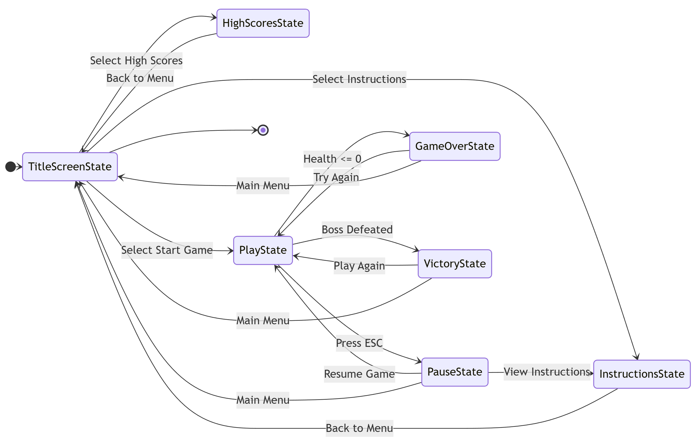

### Player States

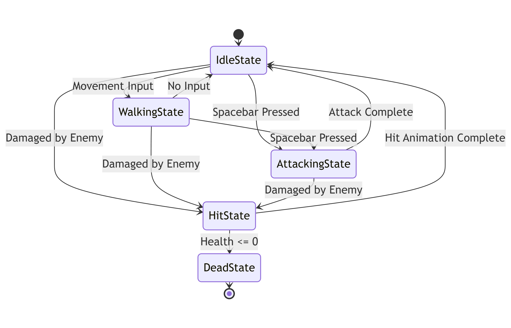

### Enemy States

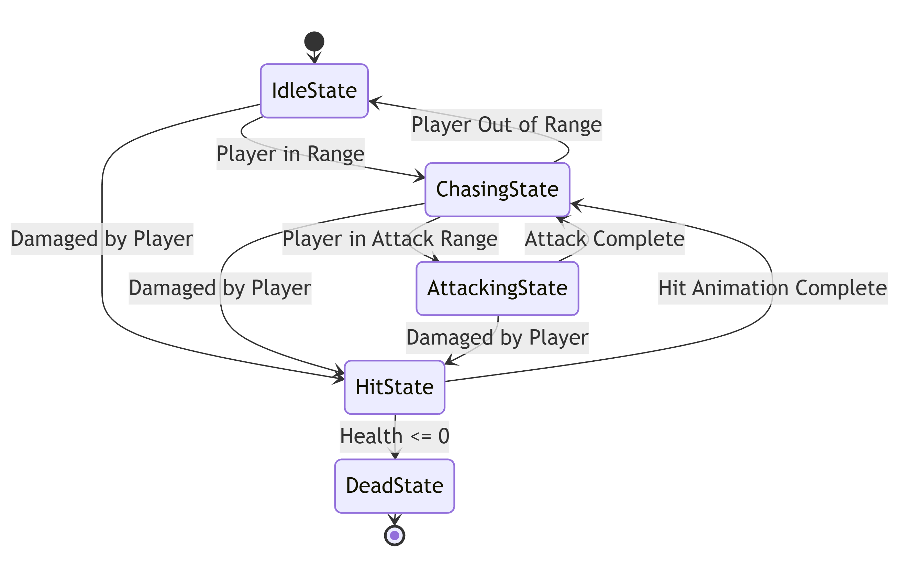

### Boss States

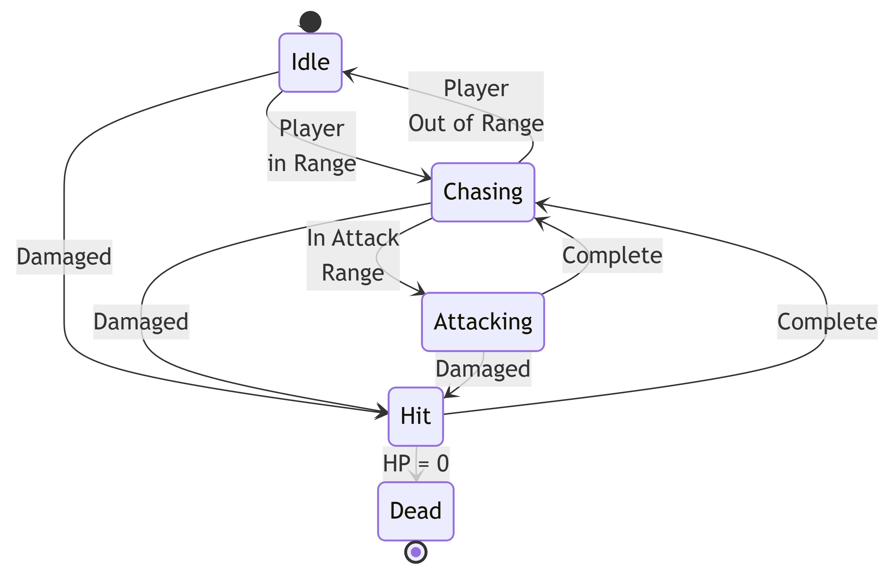

### 🗺️ Class Diagram

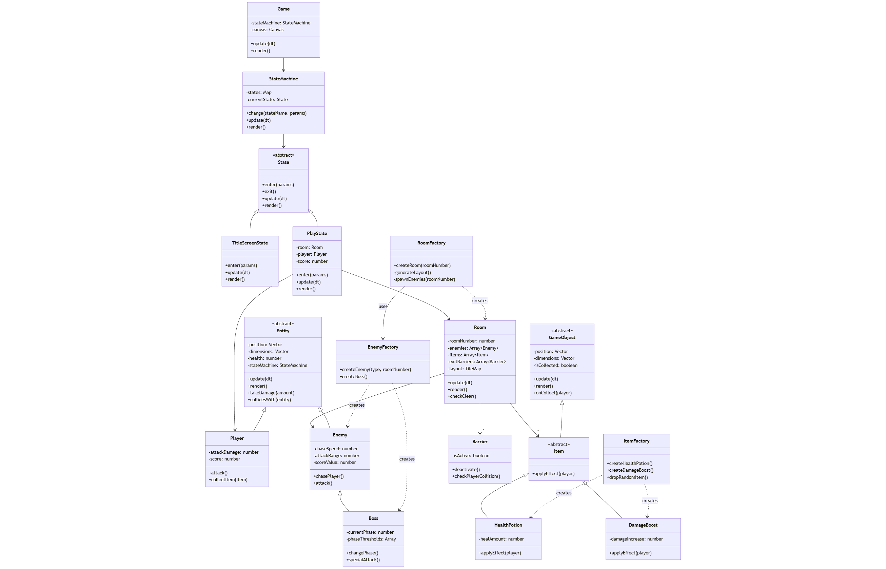

### 🧵 Wireframes

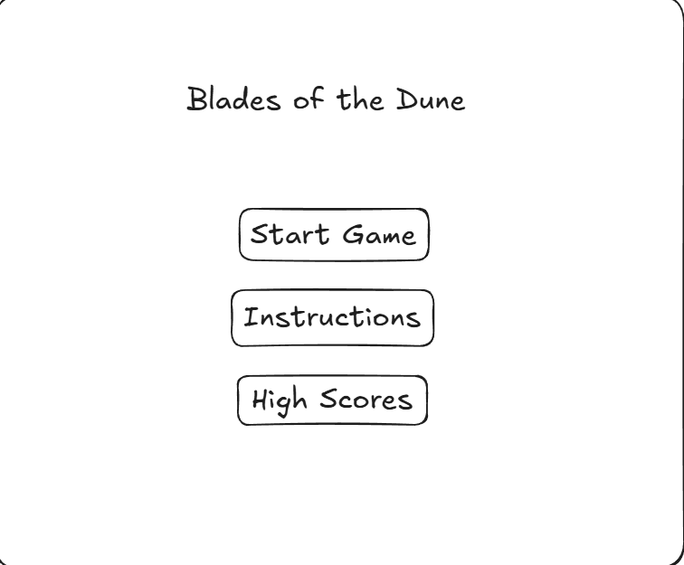
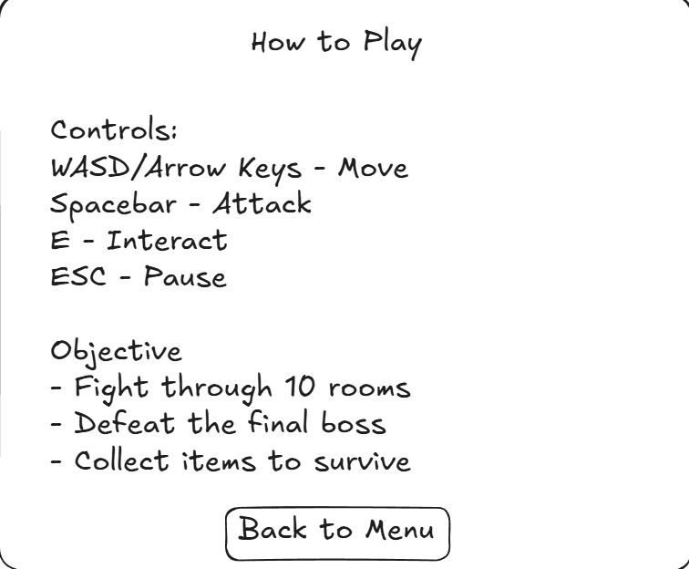
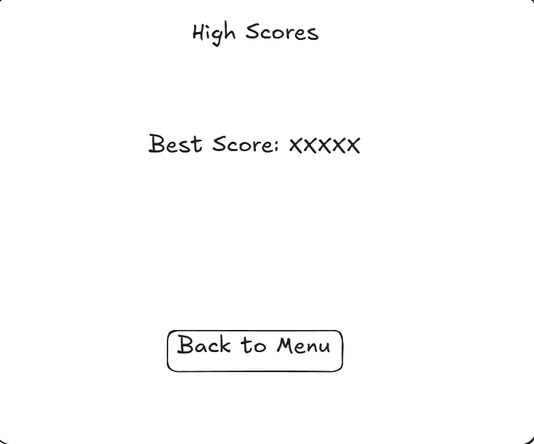
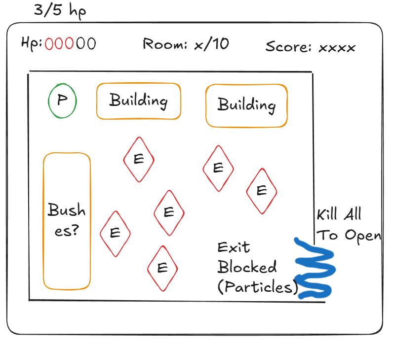
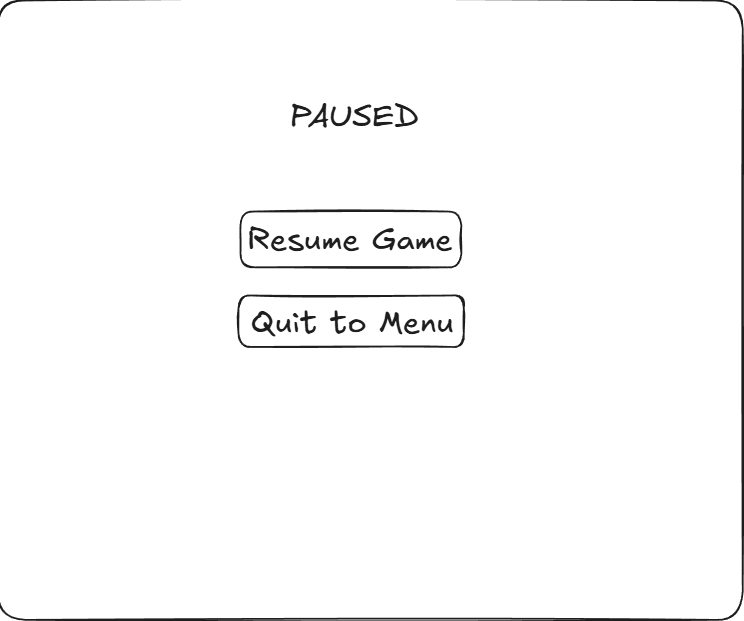
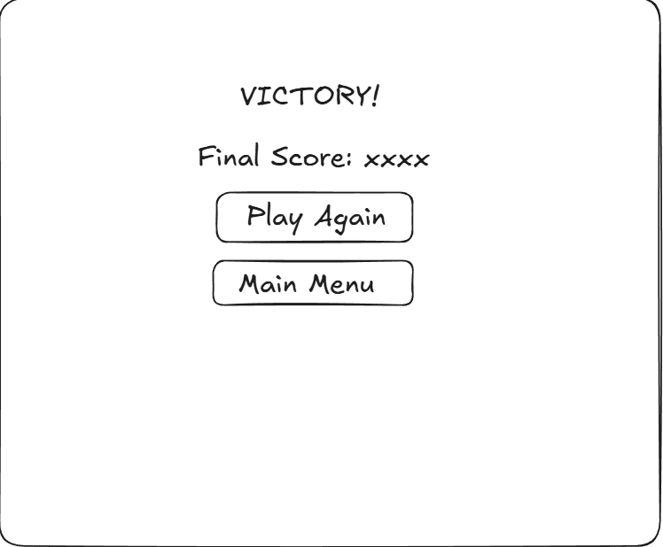
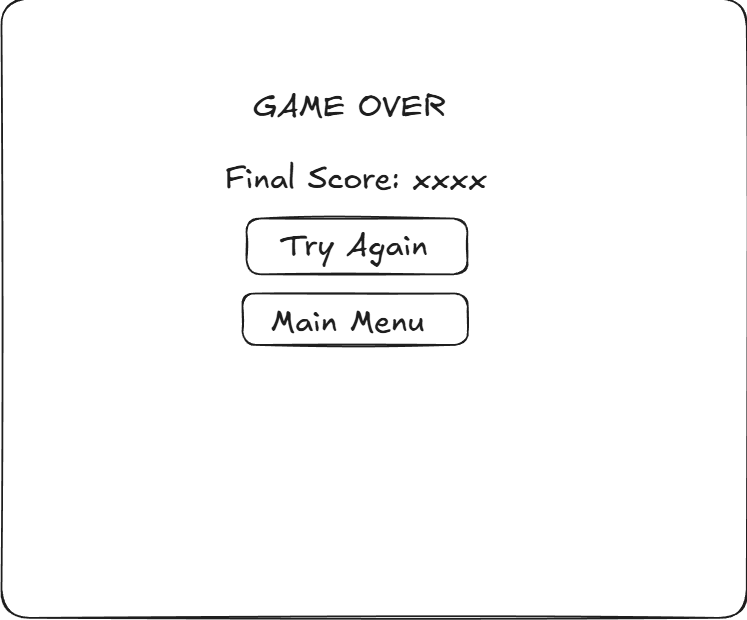

## 🎨 Assets

All game assets are sourced from the **Ninja Adventure Asset Pack** by pixel-boy, available on itch.io.

**Asset Pack:** [Ninja Adventure - Asset Pack](https://pixel-boy.itch.io/ninja-adventure-asset-pack)

### 🖼️ Graphics

**Characters & Animations:**

- 50+ character sprites with animations (player ninja, enemies, bosses)
- 30+ monster sprites with animations
- 9 boss sprites with animations (Will only use 1)
- Player animations: idle, walk, attack, hit, death
- Enemy animations: walk, attack, hit, death
- Boss animations: multiple attack patterns, phase transitions

**Environment:**

- Complete tileset for floors, walls, and decorations
- 30+ visual effects (hit effects, death animations, particles)
- UI elements (buttons, panels, health bars)

**Items:**

- 60+ item sprites (potions, keys, power-ups)

### ✏️ Fonts

The asset pack includes 2 fonts suitable for UI and text display. Additional fonts may be sourced from:

- [Google Fonts](https://fonts.google.com/)
- [DaFont](https://www.dafont.com/)

### 🔊 Audio

**Sound Effects (Included with Sprite Pack):**

- Attack sounds (sword swing, hit impact)
- Footstep sounds
- Item pickup sounds
- Damage/hurt sounds
- Enemy death sounds
- UI interaction sounds

**Music (Included with Sprite Pack):**

- Title screen music
- Gameplay/dungeon exploration music
- Boss battle music
- Victory fanfare
- Game over music

### 📚 Credits

- **Art and Audio:** pixel-boy and his contributors
- **Asset Pack** [Ninja Adventure - Asset Pack](https://pixel-boy.itch.io/ninja-adventure-asset-pack)

---
